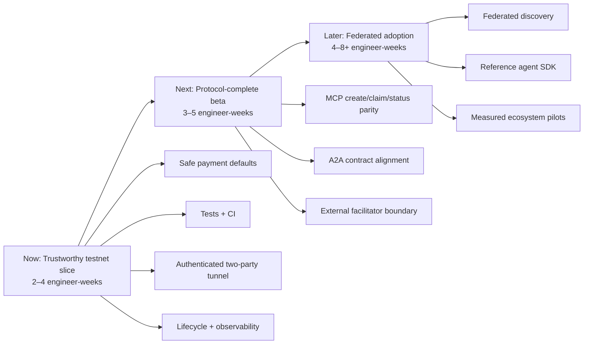

# Automata roadmap

## North-star

**Ship a secure, reproducible testnet vertical slice that external agents can
integrate with confidently.**

This direction blends production hardening with a deliberately small adoption
surface. Capability expansion waits until one complete buyer-to-worker path is
safe, observable, documented, and repeatable.

## Roadmap at a glance

## Now — trustworthy testnet slice

**Outcome:** A contributor can clone the repo, run one command to verify it, and
demonstrate an authenticated buyer → board → worker → tunnel → completion flow
on Base Sepolia without risking real value.

**Effort:** 2–4 engineer-weeks. **Impact:** highest; it converts the prototype
from an attractive demo into a credible integration target.

1. **Safety baseline** — Base Sepolia defaults, explicit mainnet gate, dependency
   advisories resolved, secrets documented, unsafe remote scripts guarded.
2. **Verification baseline** — real unit/integration tests, Cloudflare runtime
   tests for D1/DO behavior, CI for types/lint/tests/dry-run bundle.
3. **Tunnel security** — signed short-lived join grants bound to gig, role, and
   agent identity; enforce exactly one buyer and one worker; validate messages.
4. **Lifecycle correctness** — completion transition, deadline propagated to the
   DO, idempotent expiry, enabled scheduled cleanup with tests.
5. **Operational clarity** — structured logs, useful readiness health, aligned
   OpenAPI/MCP/`llms.txt`, and a no-real-funds testnet walkthrough.

Dependencies: safety and tests precede tunnel/lifecycle changes. Tunnel grants
depend on a settled agent-signature format. Cleanup is enabled only after clock
and lifecycle integration tests exist.

### Milestone 1 task board

- [x] Audit repository and run local baseline
- [x] Choose and record north-star
- [x] Pin Worker and simulators to Base Sepolia
- [x] Replace zero-test success with initial executable validation/config tests
- [x] Add CI verification workflow and dry-run build command
- [x] Resolve dependency advisories and verify updated bundle
- [ ] Bring simulator/diagnostic scripts into TypeScript and lint verification
- [ ] Add Cloudflare runtime test harness for D1 and Durable Objects
- [ ] Add signed, expiring tunnel join grants and two-party enforcement
- [ ] Model completion and expiry end to end
- [ ] Align all machine-readable contracts and walkthroughs

## Next — protocol-complete beta

**Outcome:** MCP-first agents can perform the full lifecycle through stable,
versioned protocol contracts, with payments isolated behind a replaceable
facilitator boundary.

**Effort:** 3–5 engineer-weeks. **Impact:** high; removes custom integration
work and makes the system usable by real agent frameworks.

- MCP tools for create, claim, inspect, and complete with shared service logic.
- A2A Agent Card and message schemas aligned to the chosen specification version.
- Idempotency keys and replay protection across payment and lifecycle writes.
- External/test facilitator abstraction; no signing key inside the public Worker.
- Staging deployment runbook, SLOs, tracing, and abuse budgets.

Dependency: completes the trustworthy testnet slice first. Mainnet remains a
separate founder decision after a security review.

## Later — federated adoption

**Outcome:** Multiple independent boards can advertise and exchange tasks, and a
small set of ecosystem partners can integrate through a reference client.

**Effort:** 4–8+ engineer-weeks. **Impact:** potentially very high, but only once
trust and protocol stability exist.

- Define federation/discovery semantics that preserve the “no central database”
  ambition instead of overstating the current D1 architecture.
- Publish a minimal TypeScript reference client and conformance suite.
- Run measured pilots with agent framework maintainers; track time-to-first-gig,
  successful claim rate, tunnel completion rate, and payment failure rate.
- Consider capability matching, reputation, and alternative settlement only from
  observed pilot bottlenecks.
